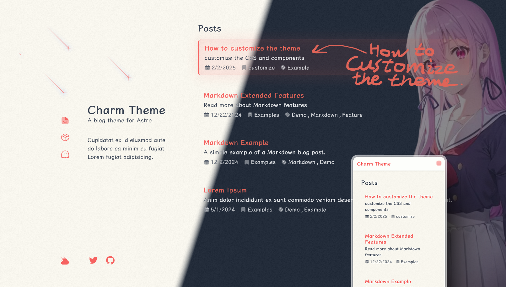

# Astro Theme: Charm Readme

Beautiful, simple and easy-to-use blog theme

:::tip
This page is [the README.md of the Github repository](https://github.com/Yuhanawa/astro-charm), but it may not be updated in time.
:::



[Github](https://github.com/yuhanawa/astro-charm) | [Live Demo](https://astro-charm.vercel.app/) | [PageSpeed](https://pagespeed.web.dev/analysis?url=https%3A%2F%2Fastro-charm.vercel.app%2F)

Note: The image on the right in the `Live Demo` is not part of the Charm theme

## Features

- Built with Astro v5
- Desktop and Mobile support
- High PageSpeed score
  - 100! [Report from Dec 29, 2024](https://pagespeed.web.dev/analysis/https-astro-charm-vercel-app/g1cxq98foh)
  - view new [PageSpeed](https://pagespeed.web.dev/analysis?url=https%3A%2F%2Fastro-charm.vercel.app%2F)
- Category and Tag page
- Dark mode
- Code Block
- Search
- Comments support (giscus)
- Google Analytics support
- Sitemap
- RSS
- Custom
  - [How to customize the theme](https://astro-charm.vercel.app/posts/custom)

## How to use

1. Run the following command to create a new project with `astro-charm` theme.

```bash
pnpm create astro-theme@latest use astro-charm
```

2. Into your project and Install `@iconify-json/simple-icons` and `@iconify-json/solar`.

```bash
pnpm add @iconify-json/simple-icons
pnpm add @iconify-json/solar
```

3. Add `src/content.config.ts` to your project.

```ts
import { collections as charmCollections } from "astro-charm/content";
export const collections = {
  // your other collections
  ...charmCollections,
};
```

4. Modify config and enjoy it!

Note: you need to add `site` to `astro.config.ts` file, because `charm` use it for `sitemap` and `rss`.

To learn more, see: [Config](#config)

<details>
  <summary>Install to existing project</summary>

1. Install `astro-charm`, `@iconify-json/simple-icons` and `@iconify-json/solar` to your project.

```bash
pnpm astro add astro-charm
pnpm add @iconify-json/simple-icons
pnpm add @iconify-json/solar
```

2. Modify `src/content.config.ts` file.

```ts
import { collections as charmCollections } from "astro-charm/content";
export const collections = {
  // your other collections
  ...charmCollections,
};
```

3. Modify `astro.config.ts` file, you can use following command to modify it.

```bash
pnpm create astro-theme@latest use astro-charm
```

Or you can modify it manually.

```ts
import { defineConfig } from "astro/config";
import charm from "astro-charm";

export default defineConfig({
  prefetch: true,
  site: "<your-site-url>",

  integrations: [
    charm({
      config: {
        lang: "en", // for HTML's lang attribute and RSS
        title: "Title on home page", // for seo on home page
        description: "Description on home page", // for seo on home page
        side: {
          title: "Title",
          sub: "Sub title",
          bio: "Your bio, about 50~90 characters, automatic line wrap",
        },
        // more config
      },
    }),
  ],
});
```

</details>


## Config

You need to add `site` to `astro.config.ts` file, because `charm` use it for `sitemap` and `rss`.

### Minimal config

```ts
import { defineConfig } from "astro/config";
import charm from "astro-charm";

export default defineConfig({
  prefetch: true,
  site: "<your-site-url>",

  integrations: [
    charm({
      config: {
        lang: "en", // for HTML's lang attribute and RSS
        title: "Title on home page", // for seo on home page
        description: "Description on home page", // for seo on home page
        side: {
          title: "Title",
          sub: "Sub title",
          bio: "Your bio, about 50~90 characters, automatic line wrap",
        },
      },
    }),
  ],
});
```

### [Config schema](https://github.com/Yuhanawa/astro-charm/blob/main/package/index.ts#L59-L152)

```ts
const configSchema = z.object({
  lang: z.string(),
  title: z.string(),
  titleSuffix: z.string().or(z.boolean()).default(true),
  description: z.string().optional(),
  author: z.string().optional(),
  placeholderImage: z.string().min(1).optional(),
  licenseId: z.enum([...licenses] as [string, ...string[]]).optional(),
  rss: z.boolean().default(true),
  googleAnalyticsId: z.string().optional(),
  font: z
    .enum(["auto", "full", "only-en", "disabled", "dynamic"])
    .default("auto"),
  shootingStar: z.boolean().default(true),
  side: z.object({
    title: z.string(),
    sub: z.string(),
    bio: z.string(),
    navHome: z
      .object({
        title: z.string().default("Home"),
        link: z.string().default("/"),
        icon: iconStringOrLightDarkOrWithStates.default({
          default: "solar:file-text-broken",
          hover: "solar:file-smile-outline",
          active: "solar:file-smile-bold-duotone",
        }),
      })
      .default({}),
    footer: z
      .array(
        z.object({
          title: z.string(),
          link: z.string(),
          icon: iconStringOrLightDarkOrWithStates,
        }),
      )
      .min(1)
      .default([
        {
          title: "Twitter",
          link: "https://x.com/",
          icon: "simple-icons:twitter",
        },
        {
          title: "GitHub",
          link: "https://github.com/yuhanawa/astro-charm",
          icon: "simple-icons:github",
        },
      ]),
    navStyle: z.enum(["default", "only-icon", "only-title"]).default("default"),
    footerStyle: z
      .enum(["default", "only-icon", "only-title"])
      .default("default"),
  }),
  markdown: z
    .object({
      colorizedBrackets: z
        .object({
          explicitTrigger: z.boolean().default(false), // if true, ```ts colorize-brackets
        })
        .default({}),
      twoslash: z
        .object({
          explicitTrigger: z.boolean().default(true), // if true, ```ts twoslash
        })
        .default({}),
    })
    .default({}),
  giscus: z
    .object({
      repo: z.string(),
      repoId: z.string(),
      category: z.string(),
      categoryId: z.string(),
      mapping: z
        .enum(["pathname", "url", "title", "og:title"])
        .default("pathname"),
      strict: z.boolean().default(false),
      reactions: z.boolean().default(true),
      emitMetadata: z.boolean().default(false),
      inputPosition: z.enum(["top", "bottom"]).default("top"),
      theme: z
        .object({
          light: z.string(),
          dark: z.string(),
        })
        .default({
          light: "light",
          dark: "dark",
        }),
    })
    .optional(),
});
```

## Troubleshooting

### [CouldNotTransformImage] Could not transform image

Please install Sharp (`sharp`) manually into your project

```bash
pnpm add sharp
```

## Questions & Suggestions

If you have any questions or suggestions, feel free to open an issue. All PRs are welcome!
